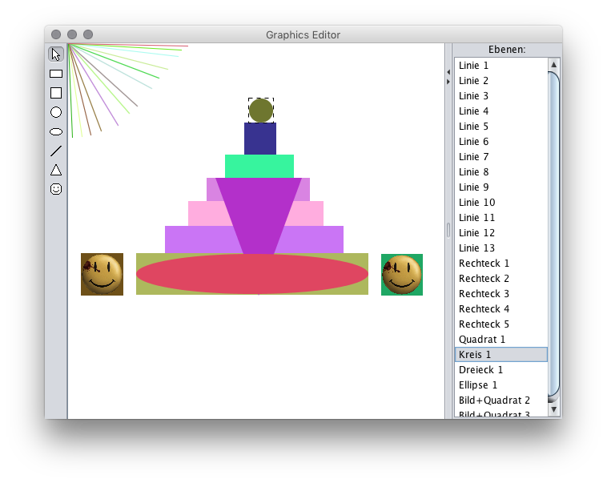

# GfxEditor

This is a Java Swing application showcasing some software design patterns as well as a couple of 2D drawing capabilities provided by Java/AWT.

## Installation
Make sure you have the [Java Runtime Environment](https://www.java.com/en/) (at least version 6) installed and double-click `gfxeditor` (on macOS) or `gfxeditor.bat` (on Windows) in the `dist` folder.

## Usage
You can select objects and move them around with the mouse. Once an object is selected, it can be deleted by pressing `Delete`. Press `Esc` to deselect the object.

Press and hold `Shift` to see the IDs of the objects.

Press the arrow keys <code>&larr;</code> & <code>&rarr;</code> to modify all objects at once. (The kind of modification depends on the shape type.)

## Building
**Dependencies:** JDK >= 1.6

Just run `make`. 
To create the API documentation, run `make docs`. 
To also create the JAR file, run `make all`.
